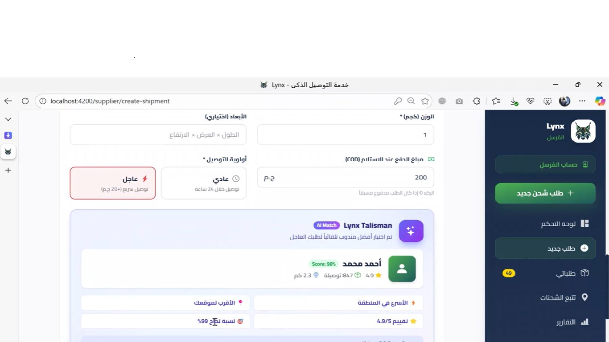

# Lynx Backend

Lynx is a flexible shipping and delivery platform built to solve a real market problem: why is shipping always restricted by product type, when what actually matters is **weight, distance, and time**?

The backend powers the core business logic of Lynx, enabling a smooth and reliable delivery experience between the **sender**, **receiver**, and **courier**, with a strong focus on **real-time tracking**, **delivery confirmation**, and **operational efficiency**.

## Overview

Most traditional shipping solutions are limited by:
- Product-type restrictions
- Inflexible pricing models
- Poor shipment visibility
- Weak delivery confirmation processes

Lynx was built to remove that complexity and replace it with a smarter model based on:
- **Weight-based shipping**
- **Dynamic courier assignment**
- **Live shipment tracking**
- **OTP-secured delivery confirmation**

## Core Features

- Weight-based shipment creation without unnecessary item-type restrictions
- Pickup and delivery location selection
- Courier recommendation and assignment
- Real-time shipment tracking
- Urgent delivery option with instant courier allocation
- OTP-based delivery confirmation for secure handoff
- Notifications system for shipment updates
- Dashboard data support for:
  - Completed shipments
  - Ongoing shipments
  - Delayed or incomplete shipments
  - Courier performance statistics
- AI-powered courier analysis and selection based on:
  - Speed
  - Rating
  - Cost efficiency
- Scheduled background jobs using cron jobs
- Maps integration for route/location handling

## Product Flow

1. The sender creates a shipment by entering:
   - Package weight
   - Pickup location
   - Delivery location

2. The system recommends the most suitable available courier.

3. The courier accepts and starts the delivery task.

4. The receiver tracks the shipment status until arrival.

5. Delivery is confirmed securely using an OTP system shared with:
   - The courier
   - The receiver

6. The shipment is marked as delivered only after successful OTP verification.

## Tech Stack

- **Framework:** ASP.NET
- **Database:** SQL Server
- **Maps Integration**
- **Cron Jobs / Background Jobs**
- **Notifications**
- **AI Integration**

## Architecture Responsibilities

This backend is responsible for:
- Business logic and workflow management
- Shipment lifecycle handling
- Courier assignment and optimization
- Secure delivery verification
- Notification triggering
- Performance analysis and data processing
- API services consumed by the frontend

## Business Model Support

The backend is designed to support Lynx’s business model, including:
- Monthly subscription plans for couriers
- Additional charges for urgent delivery requests
- Performance-based courier insights

## Why Lynx?

Lynx transforms shipping from a process full of uncertainty and friction into an experience that is:
- Flexible
- Trackable
- Secure
- Trust-based

## System Flow

## Future Plans
A mobile application is planned to further improve the user experience and make shipment tracking and delivery management even more accessible.

## Repository

This repository contains the backend services and APIs for Lynx.

## Contributing

Contributions, feedback, and suggestions are welcome.

## License

This project is licensed under the MIT License.

